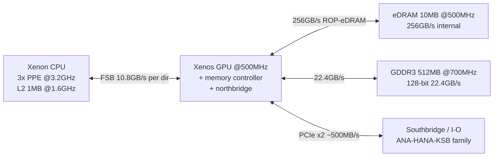

# System overview — Xbox 360 (Xenon + Xenos + UMA)

> High-level map. Details live in specialized pages. Confidence labels per claim.

## Big picture — CONFIRMED

| Block | Role | Key facts (CONFIRMED) | Primary refs |
|---|---|---|---|
| Xenon CPU (IBM “Waternoose” / XCPU) | 3× PowerPC cores, 2 SMT threads each = 6 HW threads @ 3.2 GHz, VMX128 per core, 1 MB shared L2 @ 1.6 GHz | Tri-core PowerPC, in-order, big-endian; 32 KiB L1I + 32 KiB L1D per core | Free60 Xenon CPU; Copetti CPU chapters; Wikipedia tech specs |
| Xenos GPU (ATI, codename C1) | Unified-shader GPU + northbridge + memory controller @ 500 MHz | 232M transistors parent die (90 nm TSMC); 240 vector/shader units in 3×80 SIMD groups; 16 TF + 16 TA; DirectX 9.0c superset / Shader Model 3.0+ | Wikipedia Xenos; Beyond3D Xenos article lineage; Copetti Graphics |
| eDRAM daughter die (NEC) | 10 MB @ 500 MHz, ~256 GB/s internal, logic for color/alpha/Z/stencil + 4×MSAA | 105M transistors cited; 8 ROPs; “Intelligent Memory” label in contemporary coverage | Wikipedia Xenos eDRAM section; Copetti; XenonLibrary GPU page |
| Unified memory | 512 MB GDDR3 @ 700 MHz, 128-bit, ~22.4 GB/s GPU↔RAM; CPU reaches RAM via GPU FSB | CPU FSB: 10.8 GB/s per direction (aggregated 21.6 GB/s cited); CPU inner 64-bit @ 1.35 GHz, GPU inner 128-bit @ 675 MHz, PHY 16×5.4 GHz lanes | Copetti “Main Memory / Memory Controller”; Free60 Memory page (to be expanded Cycle 2) |
| Southbridge + I/O | Audio/I/O controller linked to Xenos via 2× PCIe lanes (~500 MB/s each direction cited in Beyond3D lineage) | PARTIALLY CONFIRMED — needs ANA/HANA/KSB split in Cycle 2 | Beyond3D via mirror; to be cross-checked with XenonLibrary/ConsoleMods |
| Storage/boot | NAND flash (16 MB base; 256/512 MB on late Jasper Arcade; 4 GB eMMC/MMC on Corona/Waitsburg) + SATA HDD + DVD | PARTIALLY CONFIRMED per-revision table | ConsoleMods Buying Guide; Wikipedia revisions table |

## Simplified block diagram (text-only, only demonstrated links)

> Diagram discipline: arrows reflect interconnects reported in Copetti/Beyond3D lineage. No invented pinouts. Cycle 2 will refine SB variants.

## Why this shape (context, INFERRED with citations)

- Microsoft required IP sharing + multi-core homogeneous CPU after original-Xbox supply/security lessons (Copetti business history, citing Takahashi book + IBM sources). Marked INFERRED where it interprets motive, CONFIRMED where it reports meetings/outcomes cited to named sources.
- Unified Memory Architecture trades CPU latency for flexibility/cost: CPU cache-miss ~600 cycles to memory via PIX profiler sample (Copetti, citing SDK tool). Marked PARTIALLY CONFIRMED (single secondary citation to SDK behavior; needs XDK primary confirmation).
- Unified shaders debuted in Xenos before PC R600/TeraScale (Copetti + Beyond3D lineage). CONFIRMED as historical claim with multiple contemporary sources; micro-architectural details remain PARTIALLY CONFIRMED.

## What is NOT yet covered (UNKNOWN / Cycle 2+)

- Exact southbridge register maps, ANA/HANA video encoder programming, SMC protocol bytes, POST codes, NAND controller (SFC) programming — UNKNOWN in Cycle 1.
- Hypervisor ABI, syscall numbers, kernel object model — not documented in Cycle 1.
- No private keys, no bypass instructions. Security chain covered only at architecture level in `docs/boot/`.

## Sources / References

- Rodrigo Copetti, “Xbox 360 Architecture — A Practical Analysis”, `https://www.copetti.org/writings/consoles/xbox-360/` — main secondary synthesis with per-section bibliography (IBM Brown, Siljenberg, Gschwind, Biallas, etc.). Provides CPU/XBAR/L2/FSB/GDDR3/Xenos narrative + photos/diagrams. Accessed 2026-10-04. Evidence: high-level architecture + citations to primary IBM work.
- Free60 Wiki, “Xenon CPU”, `https://free60.org/Hardware/Console/Xenon_%28CPU%29/` — specs table (90 nm, 165M transistors, 1 MB L2, VMX-128, FSB). Accessed 2026-10-04. Evidence: community-curated spec convergence + external IBM links.
- Wikipedia, “Xbox 360 technical specifications”, `https://en.wikipedia.org/wiki/Xbox_360_technical_specifications` — CPU/GPU/motherboard summary. Tertiary; used only for convergence. Accessed 2026-10-04.
- Wikipedia, “Xenon (processor)”, `https://en.wikipedia.org/wiki/Xenon_(processor)`; “Xenos (graphics chip)”, `https://en.wikipedia.org/wiki/Xenos_(graphics_chip)` — transistor counts, clocks, SIMD grouping. Tertiary; cross-checked with Copetti/Beyond3D where possible.
- Beyond3D, “ATI Xenos” article series (original `http://www.beyond3d.com/articles/xenos/`, now via mirrors/quotes). In Cycle 1 accessed via detailed mirror excerpt returned in search (pcreview mirror thread). Provides 232M/105M transistor split, 500 MHz targets, bandwidths, ROP/eDRAM tiling. Treat as PARTIALLY CONFIRMED until original URLs re-verified via Internet Archive in Cycle 2.
- XenonLibrary, “GPU”, `https://xenonlibrary.com/wiki/GPU` (search-result mirror; direct fetch 403 on 2026-10-04, needs retry/Archive). Chip matrix Y1/Y2/Rhea/Elpis/Kronos/XCGPU/Oban + eDRAM 10 MB 256 GB/s. Marked PARTIALLY CONFIRMED pending direct verification.
- ConsoleMods Wiki, “Buying Guide — Motherboard Comparison”, `https://consolemods.org/wiki/Xbox_360:Buying_Guide` — per-revision CPU/GPU/NAND/PSU table. Accessed 2026-10-04. Evidence: photos + PCB part numbers.
